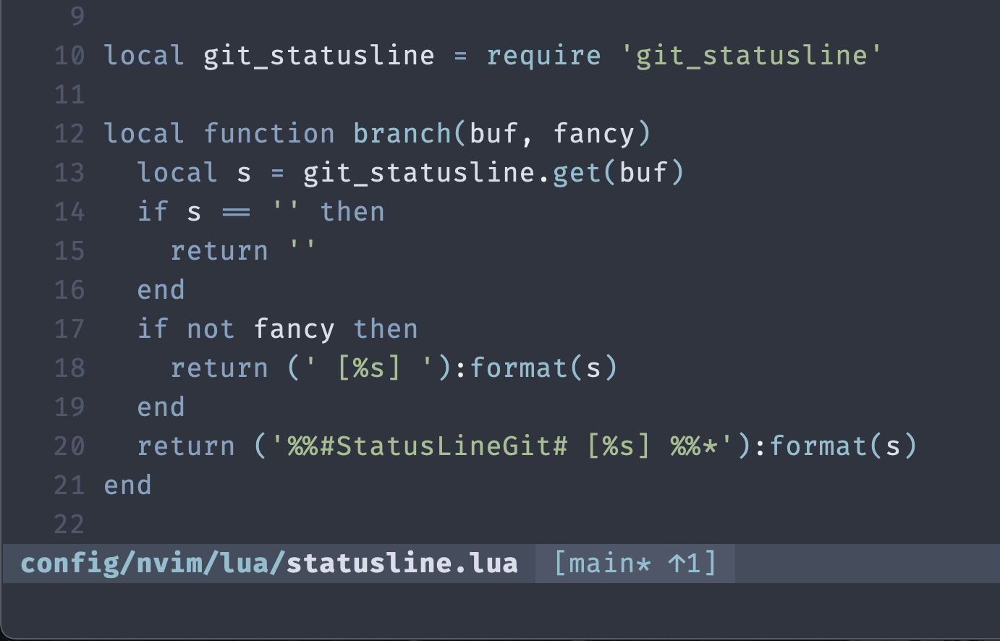

# git-statusline.nvim

Tiny Git status provider for Neovim statuslines. It exposes a single function that returns a formatted string like `main* ↑1 ↓2`.



## Install

### `vim.pack` (Neovim 0.12+)

```lua
vim.pack.add({
  "https://github.com/mattmorgis/git-statusline.nvim",
})
```

### `lazy.nvim`

```lua
{
  "mattmorgis/git-statusline.nvim"
}
```

## Native statusline

```lua
vim.o.statusline = table.concat({
  "%",
  " %f %m %r",
  " %=",
  " %y %l:%c",
})
```

Style with any statusline highlight group:

```lua
vim.o.statusline = table.concat({
  "%#User1#",
  "%",
  "%*",
  " %f %m %r %= %y %l:%c",
})
```

## API

```lua
require("git_statusline").get(bufnr) -> string
require("git_statusline").refresh(bufnr)
-- setup is optional if you want control debounce
-- more option may come later like icon and specific highlight groups (PRs welcome!)
require("git_statusline").setup({ debounce_ms = 200 })
```

## Usage

Note: have not tested these myself.

### Lualine

```lua
require("lualine").setup({
  sections = {
    lualine_c = {
      function()
        return require("git_statusline").get(0)
      end,
    },
  },
})
```

### Heirline/Feline

```lua
local git = {
  provider = function()
    return require("git_statusline").get(0)
  end,
}
```
